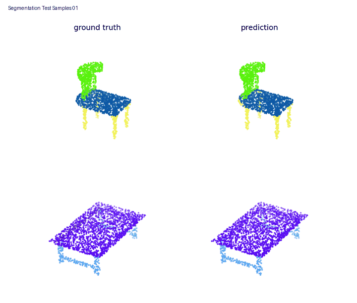
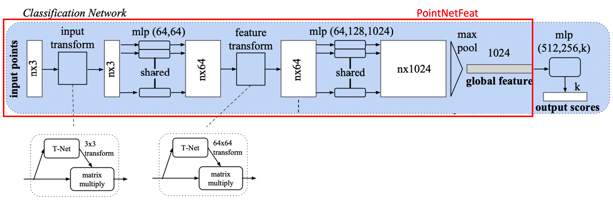
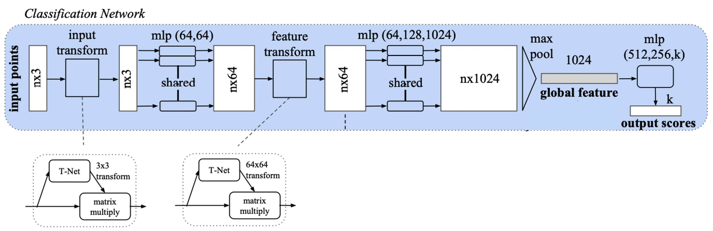
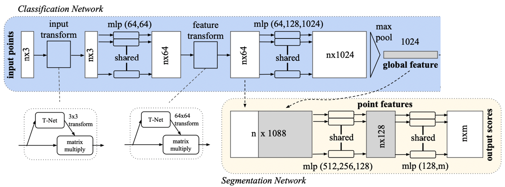
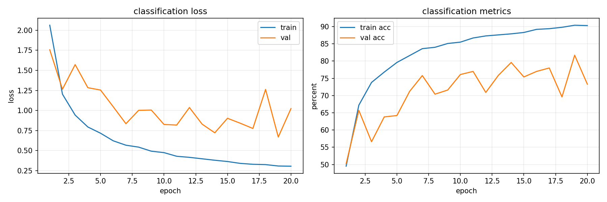
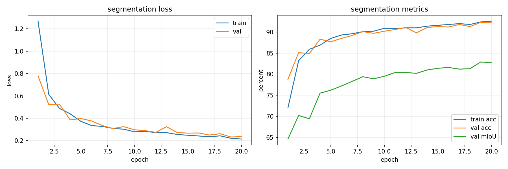
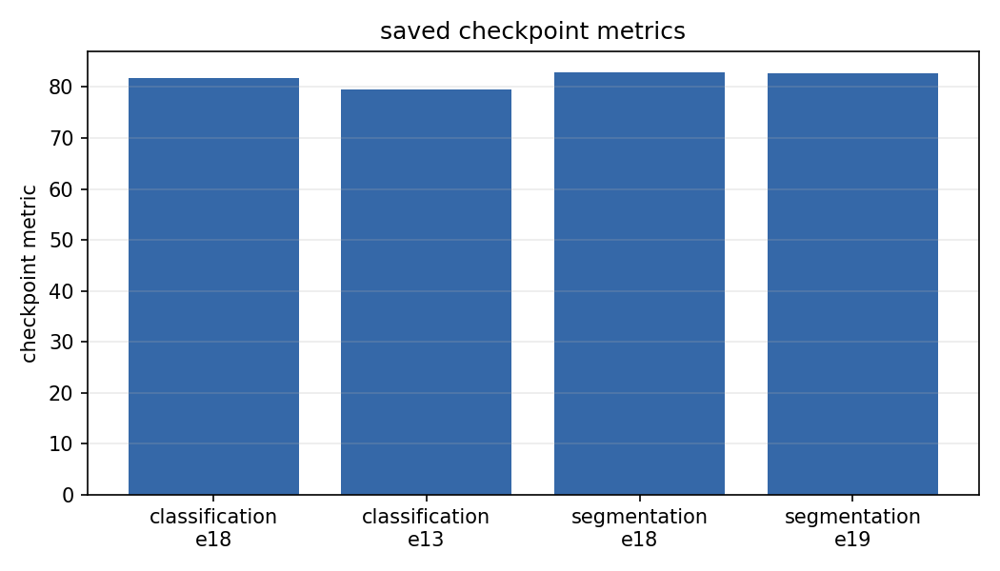
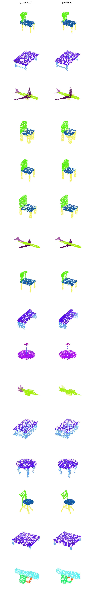

# PointNet Shape Analysis

## Abstract

Point clouds encode 3D geometry as unordered sets of spatial samples, requiring models that are invariant to point ordering while still preserving local structure for dense prediction. This work implements PointNet for two complementary shape understanding tasks: object classification on ModelNet40 and semantic part segmentation on ShapeNet Part. The network combines shared point-wise multilayer perceptrons, learned T-Net alignment, symmetric max pooling for global shape aggregation, and task-specific prediction heads for object-level and point-level inference. After 20 epochs, the completed pipeline achieves `81.7%` ModelNet40 test accuracy and `79.2%` ShapeNet Part test instance mIoU, with training curves, checkpoint summaries, and qualitative segmentation visualizations provided for analysis and reproducibility.

<p align="center">
  
</p>

<p align="center">
  <b>Animated ShapeNet Part predictions.</b>
  Each frame shows two test objects. Left column: ground truth. Right column:
  model prediction.
</p>

## Project Summary

| Area | Details |
| --- | --- |
| Core model | PointNet encoder with optional input transform and feature transform |
| Classification dataset | ModelNet40, 40 object classes, 2,048 points per object |
| Segmentation dataset | ShapeNet Part, 16 object classes, 50 part labels, 2,048 points per object |
| Classification output | One object class per point cloud |
| Segmentation output | One part label per point |
| Best recorded classification checkpoint | `Classification_ckpt_epoch18_metric81.69.ckpt` |
| Best recorded segmentation checkpoint | `Segmentation_ckpt_epoch18_metric82.85.ckpt` |
| Main implementation directory | `sub-modules/pointnet/` |
| Main wrapper scripts | `execution_scripts/run_pointnet.sh`, `execution_scripts/evaluate_pointnet.sh`, `execution_scripts/visualize_pointnet.sh` |

## Static Panels

### PointNet Feature Encoder

<p align="center">
  
</p>

The shared point encoder maps every input point through the same MLP, applies
optional learned transforms, and aggregates all point features with symmetric
max pooling. Max pooling is the step that makes the global feature invariant to
the order in which input points are listed.

### Classification Head

<p align="center">
  
</p>

The classification branch consumes the global descriptor and predicts one
ModelNet40 class. The implemented head is:

```text
1024 -> Linear 512 -> BatchNorm -> ReLU
     -> Linear 256 -> Dropout -> BatchNorm -> ReLU
     -> Linear 40
```

### Segmentation Head

<p align="center">
  
</p>

The segmentation branch concatenates each point's local feature with the global
shape feature. This gives each point access to both its local geometry and the
object-level context needed to decide which part labels are valid.

## Method

### Input Representation

Each point cloud is represented as an unordered set:

$$
P = \{x_i\}_{i=1}^{N}, \quad x_i \in \mathbb{R}^{3}, \quad N=2048.
$$

Before training and evaluation, every point cloud is centered and scaled:

$$
\tilde{x}_i = \frac{x_i - \mu}{\max_j \lVert x_j - \mu \rVert_2},
\quad
\mu = \frac{1}{N}\sum_{j=1}^{N} x_j.
$$

This normalization makes the network less sensitive to absolute translation and
scale differences between shapes.

### Learned Alignment With T-Nets

PointNet uses small spatial transformer networks to predict alignment matrices.
The input transform predicts a `3 x 3` matrix:

$$
T_3 = \operatorname{STN}_3(P),
\quad
x_i' = T_3 x_i.
$$

The feature transform predicts a `64 x 64` matrix after the first point-wise
feature layers:

$$
T_{64} = \operatorname{STN}_{64}(H),
\quad
h_i' = T_{64} h_i.
$$

The feature transform is regularized toward an orthogonal matrix:

$$
\mathcal{L}_{reg}
= \lambda \frac{1}{B}\sum_{b=1}^{B}
\left\lVert I - T_b T_b^{\top} \right\rVert_F,
\quad \lambda = 10^{-3}.
$$

This discourages degenerate feature-space transformations while still allowing
the model to learn useful canonicalization.

### Permutation-Invariant Global Feature

The encoder applies shared MLPs to every point:

$$
u_i = \phi(x_i'),
$$

where the same function `phi` is used for all points. A symmetric max operation
then produces the global shape descriptor:

$$
g = \max_{i=1}^{N} u_i,
\quad g \in \mathbb{R}^{1024}.
$$

Because max pooling is independent of the order of the points, the global
descriptor is permutation invariant.

### Classification Objective

The classifier predicts logits over 40 ModelNet classes:

$$
\hat{y} = f_{cls}(g),
\quad \hat{y} \in \mathbb{R}^{40}.
$$

The training loss is:

$$
\mathcal{L}_{cls}
= \operatorname{CE}(\hat{y}, y) + \mathcal{L}_{reg}.
$$

Implementation references:

- `sub-modules/pointnet/model.py`: `PointNetFeat`, `PointNetCls`
- `sub-modules/pointnet/train_cls.py`: classification training step

### Part Segmentation Objective

For dense part segmentation, the global feature is repeated for all points and
concatenated with point-level features:

$$
s_i = [h_i'; g],
\quad s_i \in \mathbb{R}^{1088}.
$$

The segmentation head predicts logits for 50 part labels at each point:

$$
\hat{p}_i = f_{seg}(s_i),
\quad \hat{p}_i \in \mathbb{R}^{50}.
$$

The loss is point-wise cross entropy plus feature-transform regularization:

$$
\mathcal{L}_{seg}
= \frac{1}{N}\sum_{i=1}^{N}
\operatorname{CE}(\hat{p}_i, p_i) + \mathcal{L}_{reg}.
$$

At evaluation time, predictions are masked to the valid part IDs for the known
ShapeNet object category before computing mIoU:

$$
\operatorname{IoU}_{c,k}
= \frac{|\operatorname{pred}_{c,k} \cap \operatorname{gt}_{c,k}|}
{|\operatorname{pred}_{c,k} \cup \operatorname{gt}_{c,k}|}.
$$

The instance mIoU is the mean IoU over valid parts for one object, then averaged
over evaluated objects.

Implementation references:

- `sub-modules/pointnet/model.py`: `PointNetPartSeg`
- `sub-modules/pointnet/train_seg.py`: segmentation training step
- `sub-modules/pointnet/utils/metrics.py`: masked ShapeNet Part mIoU

## Results

The following numbers are parsed from the completed training logs under
`training_runs/20260507_122029/`.

### Classification

| Task | Dataset | Epochs | Best validation metric | Test metric |
| --- | --- | ---: | ---: | ---: |
| Object classification | ModelNet40 | 20 | `81.69%` validation accuracy | `81.7%` test accuracy |

### Part Segmentation

| Task | Dataset | Epochs | Best validation metric | Test point accuracy | Test mIoU |
| --- | --- | ---: | ---: | ---: | ---: |
| Part segmentation | ShapeNet Part | 20 | `82.85%` validation mIoU | `90.0%` | `79.2%` |

### Saved Checkpoint Summary

Checkpoint binaries are intentionally ignored by Git because they are local
runtime artifacts, but the completed run produced the following files locally:

| Task | Checkpoint | Epoch | Recorded metric |
| --- | --- | ---: | ---: |
| Classification | `Classification_ckpt_epoch18_metric81.69.ckpt` | 18 | `81.69` |
| Classification | `Classification_ckpt_epoch13_metric79.58.ckpt` | 13 | `79.58` |
| Segmentation | `Segmentation_ckpt_epoch18_metric82.85.ckpt` | 18 | `82.85` |
| Segmentation | `Segmentation_ckpt_epoch19_metric82.65.ckpt` | 19 | `82.65` |

## Training Curves

| Classification | Segmentation |
| --- | --- |
|  |  |

The classification curve shows rapid accuracy growth in early epochs and a best
validation checkpoint near the end of training. The segmentation curve is more
stable, with validation mIoU rising above the assignment success threshold and
remaining near the final best checkpoint.

### Checkpoint Metrics

<p align="center">
  
</p>

## Segmentation Visualizations

The following static sheet contains 16 ShapeNet Part test samples. Each row is a
test object, the left column is ground truth, and the right column is the model
prediction.

<p align="center">
  
</p>

## Dataset Layout

The datasets are stored locally under `data/`, and the training code reads them
through symlinks in `sub-modules/pointnet/data/`.

| Dataset | Split | HDF5 files | Samples | Points per sample | Labels |
| --- | --- | ---: | ---: | ---: | --- |
| ModelNet40 | Train | 5 | 9,840 | 2,048 | 40 object classes |
| ModelNet40 | Test / validation alias | 2 | 2,468 | 2,048 | 40 object classes |
| ShapeNet Part | Train | 6 | 12,137 | 2,048 | 16 classes, 50 part IDs |
| ShapeNet Part | Validation | 1 | 1,870 | 2,048 | 16 classes, 50 part IDs |
| ShapeNet Part | Test | 2 | 2,874 | 2,048 | 16 classes, 50 part IDs |

Large dataset archives and extracted HDF5 files are ignored by Git:

```text
data/modelnet40_ply_hdf5_2048/
data/shapenet_part_seg_hdf5_data/
```

## Repository Layout

```text
Pointnet-Shape-Analysis/
├── configs/                  # YAML runtime, training, evaluation, visualization configs
├── execution_scripts/        # Shell entrypoints for the common workflows
├── Figure/                   # Assignment architecture diagrams
├── models/                   # Project-level re-export of PointNet models
├── modules/                  # Evaluation, plotting, logging, dataset, checkpoint helpers
├── sub-modules/pointnet/     # Main PointNet implementation and assignment scripts
├── analysis_outputs/         # Generated reports and visualizations
├── training_runs/            # Recorded training logs
├── visualization/            # Visualization CLI
├── evaluation/               # Evaluation CLI
├── src/                      # Training runner CLI
├── notebook/                 # Colab runner
└── README.md
```

## Installation

### Pip

```bash
cd /mntdatalora/src/Pointnet-Shape-Analysis
python3 -m pip install -r requirements.txt
```

### Conda

```bash
cd /mntdatalora/src/Pointnet-Shape-Analysis
conda env create -f configs/environment.yml
conda activate pointnet-shape-analysis
```

The conda file uses Python 3.9 and PyTorch 2.5.1 with CUDA 12.4. The local
analysis environment can differ, but `h5py`, `matplotlib`, `numpy`, `pyyaml`,
`torch`, `torchvision`, and `tqdm` are required.

## Execution

### Run Both Training Tasks

```bash
cd /mntdatalora/src/Pointnet-Shape-Analysis
./execution_scripts/run_pointnet.sh
```

Override runtime settings without editing YAML:

```bash
./execution_scripts/run_pointnet.sh --epochs 20 --batch_size 128 --lr 0.001 --gpu 0 --amp
```

Use CPU:

```bash
./execution_scripts/run_pointnet.sh --gpu -1 --no-amp
```

### Run One Task Directly

Classification:

```bash
cd /mntdatalora/src/Pointnet-Shape-Analysis/sub-modules/pointnet
python3 train_cls.py --epochs 20 --batch_size 128 --lr 0.001 --gpu 0 --amp
```

Segmentation:

```bash
cd /mntdatalora/src/Pointnet-Shape-Analysis/sub-modules/pointnet
python3 train_seg.py --epochs 20 --batch_size 128 --lr 0.001 --gpu 0 --amp
```

### Evaluate Checkpoints

```bash
cd /mntdatalora/src/Pointnet-Shape-Analysis
./execution_scripts/evaluate_pointnet.sh
```

Useful overrides:

```bash
./execution_scripts/evaluate_pointnet.sh --task classification --batch_size 128 --gpu 0
./execution_scripts/evaluate_pointnet.sh --gpu -1 --no-plots
```

### Generate Analysis Visualizations

```bash
cd /mntdatalora/src/Pointnet-Shape-Analysis
./execution_scripts/visualize_pointnet.sh
```

For log and checkpoint plots without running model evaluation:

```bash
./execution_scripts/visualize_pointnet.sh --skip-eval
```
